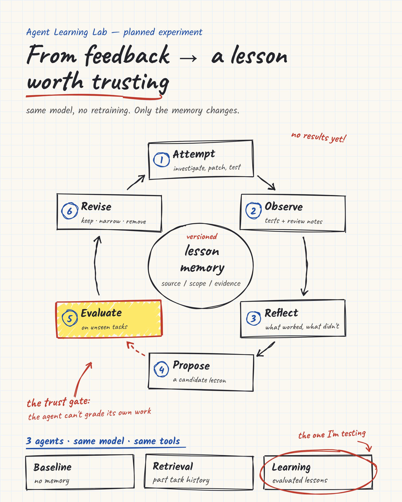
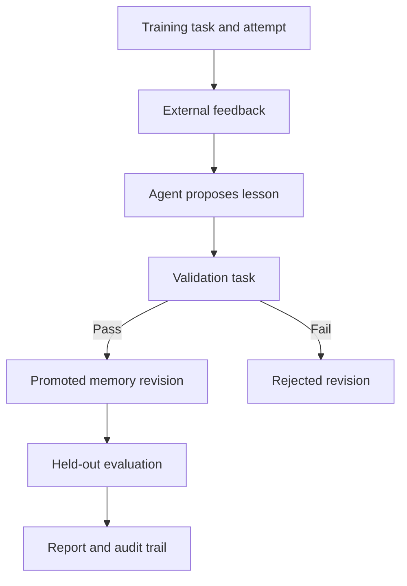

# Agent Learning Lab



**Can an agent use experience to perform better on a new task without changing model weights?**

A small MemGPT-inspired experiment built on the Letta API. Agents propose lessons from externally supplied feedback; the harness validates those lessons, records revisions in SQLite, and compares performance on held-out incident variants.

Author: Arup Chakraborty. Independent educational project; not affiliated with Letta or Oracle.

## What works today

- Zero-dependency Python CLI (Python 3.10+).
- Credential-free scripted walkthrough and live Letta REST adapter.
- Three configurations: fresh context, raw training history, evaluated lessons.
- Training, validation, and held-out test splits.
- Agent-generated reflections in live mode; external scoring and promotion gate.
- Append-only SQLite memory revisions and per-task decision audit.
- JSON results and a self-contained HTML report.
- Unit tests and GitHub Actions configuration.

**This version diagnoses incidents by selecting an action. It does not generate patches, run an agent's code, retrain a model, or demonstrate open-ended autonomous improvement.** The scripted walkthrough is hand-written behavior, not a model benchmark.

## Run the walkthrough

From this repository directory:

```bash
python -m agent_learning_lab.cli --backend scripted --output results/demo
python -m unittest discover -s tests -v
```

Open `results/demo/report.html` in your browser. Inspect `report.json` and `memory.sqlite3` for the audit trail. No packages, key, or server are required for this mode.

## Run a real Letta experiment

Set environment variables in your shell. `.env.example` is documentation, not an automatically loaded file. Never commit credentials.

```bash
export LETTA_API_KEY='your-key'
export LETTA_MODEL='openai/gpt-4.1'
python -m agent_learning_lab.cli --backend letta --output results/live --repeats 3
```

You need a Letta account/server with access to the configured model and embedding provider. The model name is configurable; provider availability depends on your server. For a local Letta server, set `LETTA_BASE_URL=http://localhost:8283` and configure its model provider. The adapter appends `/v1`, so omit `/v1` from the base URL.

The default agent type is `letta_v1_agent`. `LETTA_AGENT_TYPE=memgpt_v2_agent` is an optional compatibility experiment on servers that support it; it is not necessary to demonstrate the MemGPT-inspired learning loop. Tool-free output behavior may differ by agent type. Malformed output is recorded as a failure, not silently repaired or reclassified as success.

Live mode creates independent Letta agents and sends synthetic incidents and feedback. Agents remain available for inspection; IDs are in the JSON report. Expect approximately 21 agents at one repeat, or 45 at three repeats, plus model usage fees. Latency and raw provider usage are recorded; dollar cost is not estimated without provider prices.

## The learning loop



Each training incident produces a candidate lesson with scope and provenance. A separate validation incident checks that candidate. Passing lessons become a frozen context snapshot for held-out evaluation. Every evaluation task starts in a fresh agent to prevent test answers from leaking into subsequent tests.

The lessons arm receives memory as a read-only Letta block. The agent proposes edits; application code controls promotion. This design isolates the memory artifact being evaluated. It is **not a full reproduction of MemGPT's virtual context paging**, and does not yet evaluate agent-selected archival retrieval, autonomous memory editing, or Letta's sleep-time learning.

## Scenarios

| Family | Training cause | Transfer test | Counterexample |
| --- | --- | --- | --- |
| Asynchronous work | Assertion before completion | Index rebuild future | Deadline too short despite correct awaiting |
| Retried operations | Lost response duplicates a commit | Duplicate provisioning | Planned extension |
| Authentication | Expired bearer token | Worker reuses expired token | Planned extension |

The evaluator contains answer keys; the agent receives problem descriptions and the same action allowlist in all arms. Feedback and training experience are available only in the history/lessons configurations. Training keys and test keys are not sent to the agent.

## Interpreting results

The scripted walkthrough intentionally illustrates the loop. Its apparent improvement is programmed. It must not be quoted as AI performance evidence.

Live output is a tiny synthetic pilot. Four held-out tasks cannot establish production reliability, broad transfer, or publication-level findings. Passing one validation task can promote an overly broad lesson. The baseline model may already solve every task, leaving no measurable improvement; that is a valid result.

Raw history and lessons differ in context length. Training feedback is authored in this repository. Repeated calls are not independent new tasks. There are no confidence intervals, automatic forgetting, adversarial feedback experiments, or learning-curve claims in v0.1.

See [the evaluation protocol](docs/evaluation.md) before sharing numbers publicly.

## Publish to GitHub

The prepared package is a repository source tree. A hosted repository must still be created. To publish from your machine with GitHub CLI:

```bash
git init -b main
git add .
git commit -m "Initial Agent Learning Lab prototype"
gh auth login
gh repo create agent-learning-lab --private --source=. --remote=origin --push
```

Private is the default in these instructions. Make it public when you are ready to share it, and then use its real URL in your LinkedIn article. Alternatively create an empty repository through GitHub and push this directory to its supplied remote.

## Roadmap

1. Expand the held-out task set and add feedback-poisoning and convention-change cases.
2. Add memory ablations: shuffled lessons, irrelevant lessons, and matched token budgets.
3. Test autonomous self-editing memory and archival retrieval in separate experiments.
4. Add a background consolidation pass inspired by sleep-time learning.
5. Generate and evaluate patches inside a constrained sandbox.
6. Measure learning curves, negative transfer, and review time on realistic tasks.

## References

- [MemGPT: Towards LLMs as Operating Systems](https://arxiv.org/abs/2310.08560)
- [Letta: The AI Agents Stack](https://www.letta.com/blog/ai-agents-stack/)
- [Letta V1 SDK quickstart](https://docs.letta.com/v1-sdk)
- [Letta stateful agents](https://docs.letta.com/v1-sdk/concepts/stateful-agents)

The live adapter follows the documented Letta REST contract. Local tests validate its request construction and response handling against mocked responses. A real authenticated Letta run is required to verify compatibility with your deployed server.
